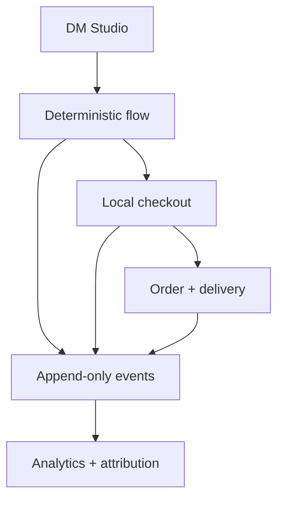

# DM Commerce OS

**Run an entire inbound DM-to-digital-delivery loop on your laptop—no API keys, payment account, or hosted database required.**

DM Commerce OS is a local-first reference application for creators and developers who want to inspect how a social keyword becomes a deterministic conversation, attributed checkout, order, file delivery, and measurable event trail. The golden demo is seeded, resettable, and backed by SQLite.


## Why this project is useful

- **Complete local loop:** inbound keyword → flow decision → checkout → order → PDF delivery → campaign analytics.
- **Inspectable decisions:** a deterministic state machine and append-only commerce events make the demo explainable.
- **Portable automation:** validated, versioned JSON flow packs can be exported and imported without copying database rows.
- **Swappable boundaries:** typed payment and delivery provider interfaces isolate the explicit mock/local implementations.
- **Credible demo data:** six attributed customers and orders, two campaigns, coupons, objections, and seven days of event-backed analytics are available after one seed command.
- **No-key start:** demo auth, SQLite, mock payment authorization, and local files work without third-party services.

This is a development sandbox and reference architecture, not a production payment processor or social-network integration.

## Quick start

Requirements: Node.js 20.19+, 22.13+, or 24+ and npm (use an active LTS line).

```bash
git clone https://github.com/constripacity/DM-Commerce-OS.git
cd DM-Commerce-OS
npm run setup
npm run dev
```

Open [http://localhost:3000/login](http://localhost:3000/login) and sign in with:

- Email: `demo@local.test`
- Password: `demo123`

`npm run setup` installs the locked dependencies before loading the TypeScript setup helper, creates a private `.env`, generates Prisma Client, applies migrations, and seeds the golden demo. It is safe to rerun.

For a manual installation:

```bash
cp .env.example .env
# Replace APP_SECRET with a random string at least 32 characters long.
npm ci
npm run prisma:generate
npm run prisma:migrate:deploy
npm run db:seed
npm run dev
```

`DATABASE_URL="file:./dev.db"` is resolved by Prisma relative to `prisma/schema.prisma`, so the generated database is `prisma/dev.db`.

See [the beginner guide](docs/BEGINNER-GUIDE.md) or [Windows setup](docs/WINDOWS-SETUP.md) for troubleshooting.

## Golden demo

After seeding, try this path:

1. Open **DM Studio**, select the Creator DM Push campaign and Creator DM Guide product.
2. Send `GUIDE`, then `yes`, then `how much?`.
3. Follow **Simulate checkout** to Products.
4. Enter a buyer and use coupon `LAUNCH20`.
5. Inspect the attributed, price-snapshotted order and local PDF in **Orders**.
6. Open **Analytics** to see the new conversation, checkout, order, delivery, revenue, and campaign attribution derived from persisted events.
7. Use **Scripts → Export flow** to inspect the portable automation JSON.

Use **Settings → Reset demo data** to atomically remove local catalog/conversation/order/config changes and restore the fixtures. The `npm run reset:demo` command performs the same deterministic restore through Prisma's migrate-reset workflow. Both are intentionally destructive.

## What is real and what is simulated

| Capability | Implementation |
| --- | --- |
| Session boundary | Real signed, expiring, HTTP-only cookie; local demo credentials |
| Conversation decisions | Real deterministic state machine and persisted messages/events |
| Catalog, customers, orders, coupons | Real Prisma persistence in local SQLite |
| Campaign attribution and analytics | Real calculations over persisted orders and append-only events |
| Payment | Explicit `MockPaymentProvider`; no funds move |
| Delivery | `LocalFileDeliveryProvider` validates and returns a local PDF path |
| Social inbox, email, webhooks | Not integrated |

## Architecture



The App Router UI calls authenticated route handlers. Business rules live in `src/lib`: the flow state machine, coupon pricing, checkout orchestration, typed providers, event vocabulary, and flow-pack validation. Prisma owns the local persistence boundary. Read [the architecture guide](docs/ARCHITECTURE.md) for module and trust-boundary details.

## Features

| Area | Current behavior |
| --- | --- |
| DM Studio | Campaign/product context, deterministic intents, objection handling, persisted messages and stage events |
| Checkout | Customer upsert, coupon rules, immutable price snapshots, typed mock payment/local delivery adapters |
| Orders | Status, attribution, discounts, totals, customer identity, verified local download |
| Analytics | Rolling seven-day funnel, revenue, product/campaign mix, objections, median time to checkout |
| Flow packs | 100 KB-capped, Zod-validated, versioned JSON import/export |
| Catalog/campaigns/scripts | Authenticated CRUD with server-side validation |
| Settings | Brand settings and signature-checked PNG/JPEG/WebP logos in private runtime storage, served by an authenticated route (2 MB maximum) |
| Demo reset | Atomic deterministic products, campaigns, scripts, coupon, settings, customers, orders, and events |

## Development commands

| Command | Purpose |
| --- | --- |
| `npm run setup` | Fresh-clone environment, install, migrate, and seed |
| `npm run dev` | Start the local development server |
| `npm run lint` | Run the Next.js ESLint configuration |
| `npm run typecheck` | Run TypeScript without emitting files |
| `npm test` | Run Vitest unit and regression tests |
| `npm run build` | Create the production Next.js build |
| `npm run smoke` | Probe auth, primary APIs, flow export, and cross-origin rejection against a running server |
| `npm run smoke:production` | Destructively exercise runtime logo delivery and deterministic reset against a disposable seeded production server |
| `npm run validate:fixtures` | Validate seeded PDFs structurally and with `pdfinfo` when available |
| `npm run test:install` | Install Playwright browsers |
| `npm run test:e2e` | Reset/seed only `prisma/e2e.db` and exercise the browser golden path |
| `npm run reset:demo` | Reset migrations and reseed local fixtures |
| `npm run scan:sensitive` | Scan Git-visible source for likely sensitive material and emit a redacted private report |

## Security posture

All application-data write routes require the signed demo session and reject cross-site browser mutations; login and logout are the origin-checked session-boundary exceptions. Redirect targets are constrained to the dashboard, flow imports are size/schema limited, downloads are allow-listed local PDFs, and logo uploads use generated names, bounded content signatures, private runtime storage, and an authenticated delivery route. A legacy service worker is actively removed so private APIs and dashboards are never replayed from its cache. See [SECURITY.md](SECURITY.md) for reporting and scope.

The demo password is public by design. Change or remove demo auth before adapting this project for any shared or internet-facing environment.

## Project status and limits

- SQLite and local files are intentional; horizontal deployment is not supported.
- Payment authorization and delivery are adapters backed by mock/local implementations.
- There is no live Instagram, TikTok, email, tax, refund, inventory, or webhook integration.
- Event properties are JSON strings in SQLite; they are validated at write sites, not by the database.
- The legacy `DM Commerce Latest UI/` snapshot remains for provenance but is excluded from the active TypeScript build.

See [the revival audit](docs/REVIVAL_AUDIT.md), [revival changelog](docs/REVIVAL_CHANGELOG.md), and [next 18 commits](docs/NEXT_20_COMMITS.md) for verified state and ordered follow-up work.

## Contributing

Bug reports and focused pull requests are welcome. Read [CONTRIBUTING.md](CONTRIBUTING.md), include tests for behavior changes, and keep the default path offline and no-key.

## License

[MIT](LICENSE)
